# DentWise - Your AI-Powered Dental Assistant


## 📋 Project Overview

DentWise is an AI-powered dental assistant application that helps users get instant answers about dental concerns, receive preliminary diagnoses, connect with qualified dentists, and track their dental health journey.

## 📸 Screenshots

### Landing Page

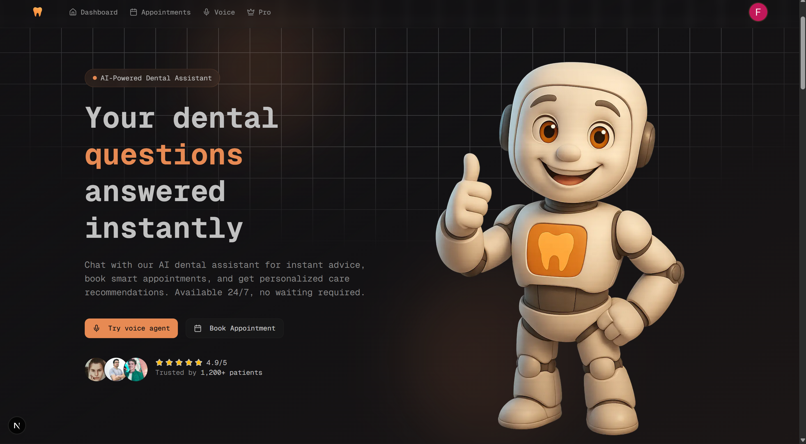
_Modern hero section with clear call-to-action_

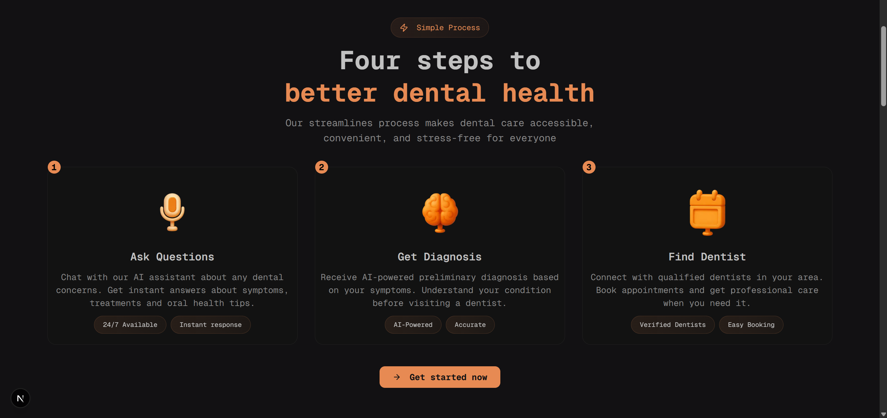
_-step process explaining the platform_

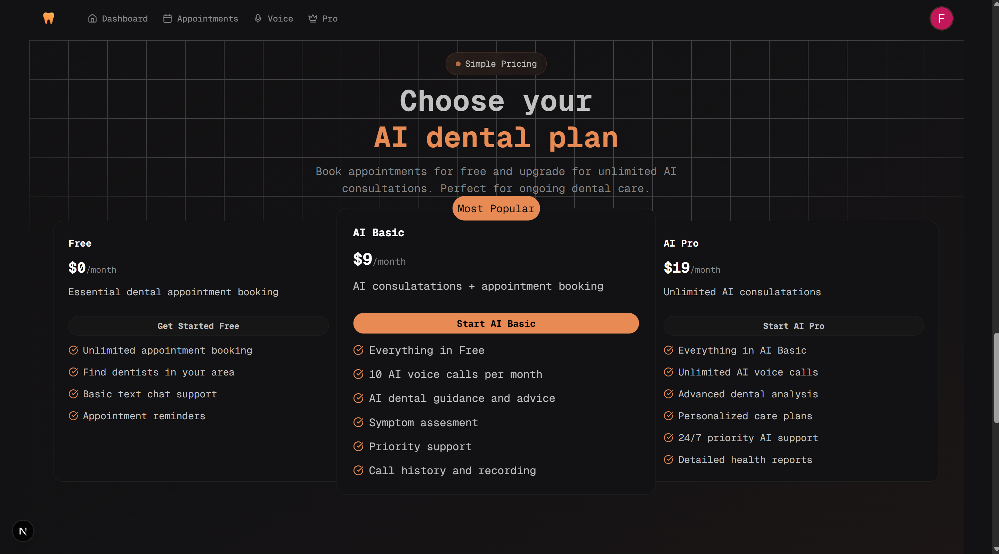
_Flexible pricing tiers with feature comparison_

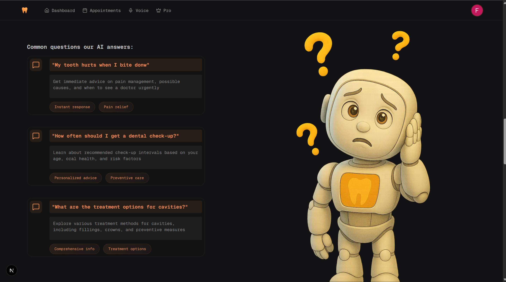
_Frequently asked questions section_

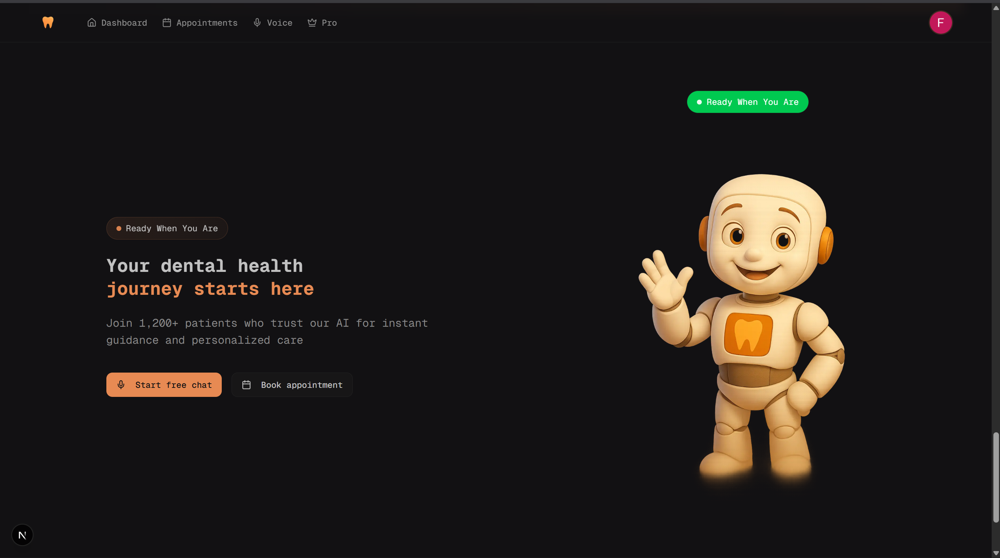
_Engaging CTA section_

### Application Pages

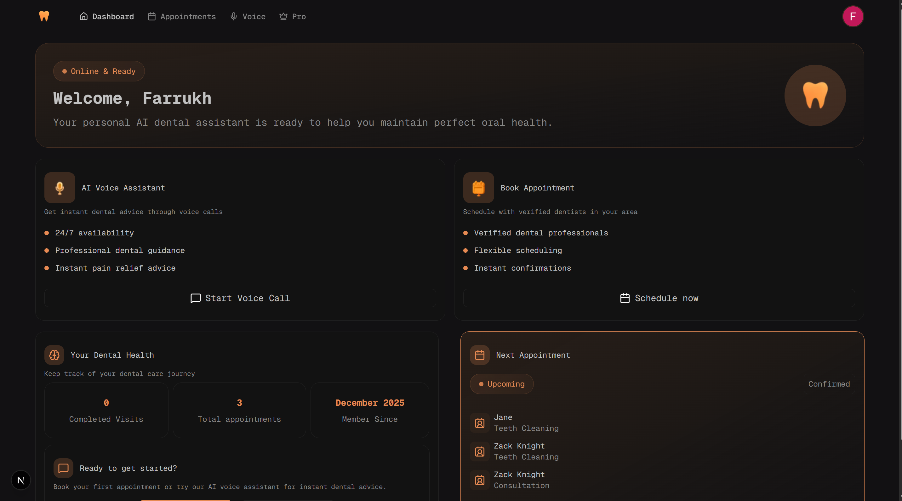
_Personalized user dashboard with appointments and health tracking_

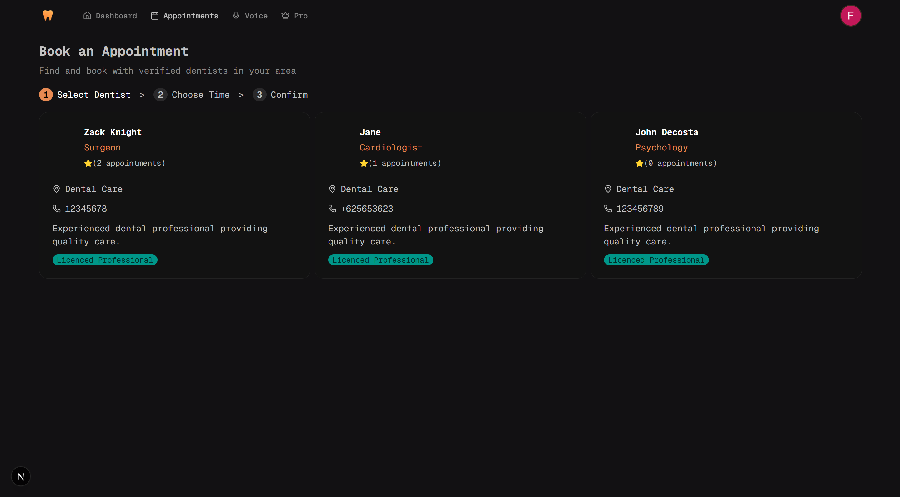
_Multi-step appointment booking flow - Doctor selection_

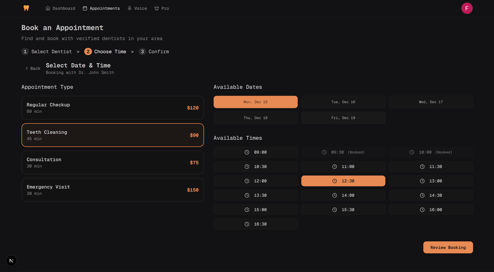
_Appointment booking - Date and time selection step_

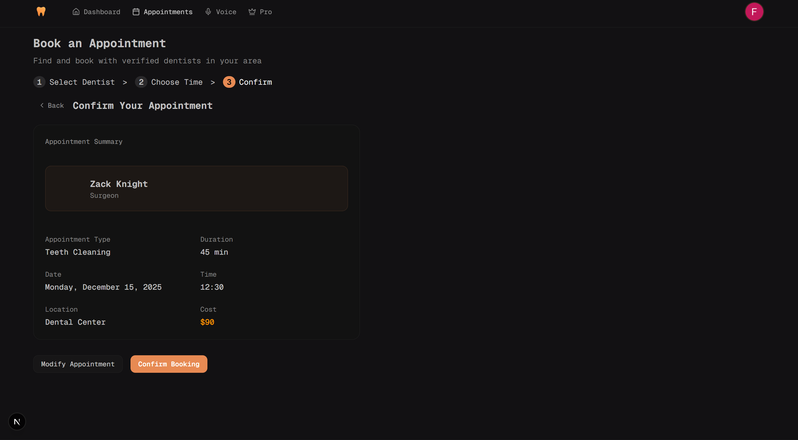
_Appointment booking - Confirmation and review step_

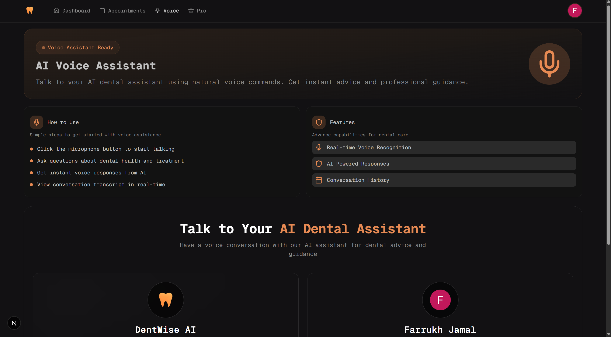
_AI-powered voice consultation interface_

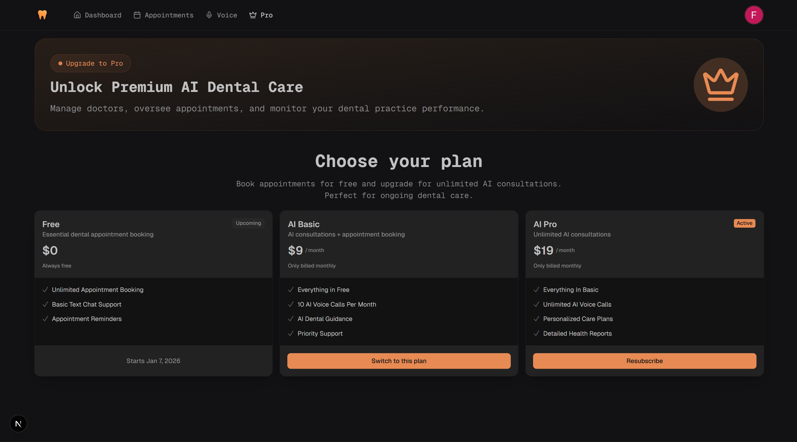
_Subscription management and upgrade page_

### Features

#### 🏥 Appointment Booking System

- **Multi-Step Booking Flow**: Intuitive 3-step appointment booking process
  - **Step 1 - Select Dentist**: Browse and select from available dentists with detailed profiles
  - **Step 2 - Choose Date & Time**:
    - Select appointment type (Regular Checkup, Teeth Cleaning, Consultation, Emergency Visit)
    - Choose from available dates (next 5 days)
    - Pick available time slots (9 AM - 5 PM, 30-minute intervals)
    - Real-time slot availability checking
  - **Step 3 - Confirm Booking**: Review appointment details and confirm
- **Appointment Management**: View upcoming appointments on dashboard
- **Real-time Availability**: Dynamic slot booking with conflict prevention
- **Appointment Types**: Multiple service types with different durations and pricing

#### 🎨 User Interface

- **Responsive Design**: Mobile-first design that works seamlessly across all devices
- **Modern Landing Page**:
  - Hero section with clear call-to-action
  - How It Works section explaining the 4-step process
  - Pricing tiers with feature comparison
  - Testimonials and FAQ sections
  - Smooth navigation with anchor links
- **Dashboard**: Personalized user dashboard with:
  - Welcome card with user greeting
  - Upcoming appointments display
  - Dental health journey tracking
  - Quick action buttons for AI Assistant and Booking
- **Theme Consistency**: Unified color scheme using primary theme colors throughout

#### 🤖 AI-Powered Features

- **Voice Assistant**: AI-powered voice consultations for premium subscribers
  - Real-time voice recognition
  - Natural language conversations
  - Instant AI responses
  - Conversation history tracking
  - Subscription-gated access (AI Basic/Pro plans)

#### 💳 Subscription Management

- **Flexible Pricing Tiers**: Three subscription levels via Clerk integration
  - **Free**: Unlimited appointment booking, find dentists, basic features
  - **AI Basic**: 10 AI voice calls/month, AI guidance, symptom assessment
  - **AI Pro**: Unlimited AI voice calls, advanced analysis, personalized care plans
- **Upgrade Flow**: Seamless upgrade experience with Clerk PricingTable
- **Plan-based Access Control**: Feature gating based on subscription tier

#### 👨‍⚕️ Admin Dashboard

- **Comprehensive Management Panel**: Full-featured admin interface
  - Real-time metrics and statistics
  - Total doctors, active doctors count
  - Total appointments, completed appointments tracking
- **Doctor Management**:
  - Add new doctors with complete profiles
  - Edit existing doctor information
  - View all doctors with status indicators
  - Auto-generated avatars based on gender
  - Track appointment count per doctor
- **Appointment Tracking**:
  - View all appointments in data table format
  - Filter and sort appointments
  - Status management (Scheduled, Completed, Canceled)
  - Color-coded status badges
  - Patient and doctor information display

#### 🔐 Authentication & Security

- **Clerk Authentication**: Secure user authentication and session management
- **User Synchronization**: Automatic user data sync with database
- **Role-based Access**: Admin dashboard restricted to authorized users
- **Protected Routes**: Route-level authentication for sensitive pages

#### 🛠️ Technical Features

- **Modular Component Architecture**: Reusable, well-organized components
  - Separate components for appointment type selection, date calendar, time slots
  - Shared UI components across the application
  - Clean separation of concerns
- **Server Actions**: Type-safe server-side operations with Next.js
- **React Query Integration**: Efficient data fetching, caching, and synchronization
  - Optimistic updates
  - Automatic cache invalidation
  - Query options for reusable data fetching logic
- **Form Validation**: Zod schema validation with React Hook Form
- **Type Safety**: Full TypeScript support with Prisma-generated types
- **Code Quality**: ESLint, Prettier with Husky pre-commit hooks

## 🚀 Getting Started

### Prerequisites

- Node.js 18+
- npm or yarn

### Installation

1. Clone the repository

```bash
git clone https://github.com/farrukh806/dentiwise.git
cd dentiwise
```

2. Install dependencies

```bash
npm install
```

3. Set up environment variables

```bash
cp .env.example .env.local
```

4. Run the development server

```bash
npm run dev
```

Open [http://localhost:3000](http://localhost:3000) with your browser to see the application.

## 📦 Tech Stack

- **Frontend**: Next.js 16, React 19, TypeScript
- **Styling**: Tailwind CSS, shadcn/ui
- **Authentication**: Clerk (with subscription management via Clerk PricingTable)
- **Database**: PostgreSQL with Prisma ORM
- **State Management**: TanStack Query (React Query) for server state
- **Form Management**: React Hook Form, Zod
- **UI Components**: Radix UI, Lucide Icons
- **Charts**: Recharts
- **Notifications**: Sonner (toast notifications)
- **Code Quality**: ESLint, Prettier (with Husky pre-commit hooks)

## 🔧 Available Scripts

```bash
# Development server
npm run dev

# Build for production
npm run build

# Start production server
npm start

# Run linter
npm run lint

# Format code with Prettier
npm run format

# Check formatting
npm run format:check
```

## 📁 Project Structure

```
├── app/                    # Next.js app directory
│   ├── (auth)/            # Authenticated route group
│   │   ├── admin/        # Admin dashboard pages
│   │   ├── pro/          # Subscription/upgrade page
│   │   ├── voice/        # Voice assistant page
│   │   └── layout.tsx    # Shared layout for auth routes
│   ├── prisma/            # Prisma generated types
│   └── validations/       # Zod validation schemas
├── components/             # Reusable React components
│   ├── ui/                # shadcn/ui components
│   ├── admin/             # Admin-specific components
│   │   ├── add-update-doctor.tsx
│   │   ├── appointment-table.tsx
│   │   ├── status-card.tsx
│   │   ├── status-section.tsx
│   │   ├── status-table.tsx
│   │   └── doctor-item.tsx
│   ├── appointments/      # Appointment booking components
│   │   ├── doctor-selection.tsx
│   │   ├── doctor-card.tsx
│   │   ├── doctor-skeleton.tsx
│   │   ├── date-selection.tsx
│   │   ├── appointment-type-selection.tsx
│   │   ├── date-calendar.tsx
│   │   ├── time-slot-selection.tsx
│   │   ├── confirmation-step.tsx
│   │   ├── appointment-summary.tsx
│   │   └── step.tsx
│   ├── common/            # Common shared components
│   │   ├── badge.tsx
│   │   ├── data-table.tsx
│   │   ├── navbar.tsx
│   │   ├── sign-in-button.tsx
│   │   ├── sign-up-button.tsx
│   │   ├── user-sync.tsx
│   │   ├── welcome-card.tsx
│   │   └── container-wrapper.tsx
│   ├── dashboard/         # Dashboard components
│   │   ├── action.tsx
│   │   ├── appointments.tsx
│   │   └── dental-journey.tsx
│   ├── landing/           # Landing page components
│   │   ├── header.tsx
│   │   ├── hero.tsx
│   │   ├── how-it-works.tsx
│   │   ├── card.tsx
│   │   ├── pricing.tsx
│   │   ├── pricing-card.tsx
│   │   ├── testimonials.tsx
│   │   ├── cta.tsx
│   │   ├── footer.tsx
│   │   ├── action-section.tsx
│   │   ├── question.tsx
│   │   └── what-to-ask.tsx
│   └── voice/             # Voice assistant components
│       ├── feature-item.tsx
│       ├── how-to-use-item.tsx
│       └── pro-plan-require.tsx
├── hooks/                 # Custom React hooks
├── lib/                   # Utility functions and actions
│   ├── actions/          # Server actions (doctors, appointments, user)
│   ├── query-options/     # TanStack Query options
│   └── constants.ts       # App constants (pricing, plans)
├── public/                # Static assets
├── prisma/                # Prisma schema and migrations
├── .husky/               # Git hooks
├── package.json
└── tsconfig.json
```

## 🧩 Components Overview

### Landing Page Components

- **Header**: Navigation header for the landing page
- **Hero**: Main hero section with call-to-action
- **HowItWorks**: Four-step process section (Ask Questions, Get Diagnosis, Find Dentist, Track Progress)
- **Card**: Reusable card component for displaying features
- **Pricing**: Pricing section with multiple pricing tiers
- **PricingCard**: Individual pricing card with "Most Popular" badge
- **Testimonials**: Customer testimonials carousel
- **CTA**: Call-to-action sections
- **Footer**: Footer with links and company info
- **ActionSection**: Action-driven content sections
- **Question**: FAQ or question components
- **WhatToAsk**: Suggested questions/prompts section

### Common Components

- **Badge**: Reusable badge component for displaying labels and status indicators
- **DataTable**: Reusable data table component built with TanStack Table for displaying tabular data with sorting, filtering, and pagination
- **Navbar**: Main navigation bar component with user authentication, responsive mobile menu, and navigation links (Dashboard, Appointments, Voice, Pro)
- **SignInButton**: Wrapper component for Clerk's sign-in functionality with modal mode
- **SignUpButton**: Wrapper component for Clerk's sign-up functionality with modal mode
- **UserSync**: Client component that automatically synchronizes authenticated user data with the database
- **WelcomeCard**: Reusable welcome card component with badge, headline, description, and icon. Used across admin, pro, and voice pages for consistent header sections
- **ContainerWrapper**: Layout wrapper component providing consistent container styling with responsive padding and margins

### Admin Components

- **StatusCard**: Card component for displaying status metrics with icon, count, and description (used in admin dashboard)
- **StatusSection**: Dashboard metrics section displaying key statistics including total doctors, active doctors, total appointments, and completed appointments
- **StatusTable**: Doctors management table component that displays all doctors with their information and provides add/edit functionality
- **DoctorItem**: Table row component for displaying doctor information including avatar, name, speciality, gender, contact details, appointment count, active status, and edit button
- **AddUpdateDoctor**: Dialog form component for adding new doctors or updating existing doctor information. Features include:
  - Form validation using Zod
  - Fields: name, email, phone, speciality, gender, status
  - Automatic form reset when dialog opens
  - Real-time data synchronization with TanStack Query
  - Toast notifications for success/error states
- **AppointmentTable**: Data table component for displaying and managing appointments with columns for:
  - Patient information (name and email)
  - Doctor name
  - Date and time
  - Appointment reason
  - Status (Scheduled, Completed, Canceled) with color-coded badges
  - Action column for future status toggling

### Voice Assistant Components

- **FeatureItem**: Component displaying voice assistant features with icon and title (Real-time Voice Recognition, AI-Powered Responses, Conversation History)
- **HowToUseItem**: List item component for displaying step-by-step instructions on how to use the voice assistant
- **ProPlanRequired**: Upgrade prompt component shown to users without AI Basic or AI Pro subscriptions, featuring:
  - Lock icon and upgrade messaging
  - Feature highlights
  - Direct link to upgrade page
  - Responsive card design with hover effects

## 🎯 Features Overview

### Voice Assistant

The voice assistant feature provides AI-powered dental consultations through natural voice conversations:

- **Access Control**: Requires AI Basic or AI Pro subscription (checked via Clerk plan verification)
- **Features**:
  - Real-time voice recognition
  - AI-powered responses
  - Conversation history tracking
- **User Interface**:
  - Welcome card with feature introduction
  - Two-column layout with "How to Use" and "Features" sections
  - Equal-width responsive cards using flexbox
  - Upgrade prompt for non-subscribers
- **Layout**: Dedicated route group with shared layout and welcome card

### Subscription Management

- **Pro/Upgrade Page**: Subscription management page featuring:
  - Welcome card with premium messaging
  - Clerk PricingTable integration with shadcn theme
  - Plan selection and upgrade flow
  - Responsive design with centered content
- **Plan Tiers**:
  - **Free**: Unlimited appointment booking, find dentists, basic text chat
  - **AI Basic**: 10 AI voice calls/month, AI guidance, symptom assessment
  - **AI Pro**: Unlimited AI voice calls, advanced analysis, personalized care plans
- **Access Control**: Plan-based feature gating throughout the application

## 🎯 Admin Dashboard Features

The admin dashboard provides comprehensive management tools for dental practice administrators:

### Dashboard Overview

- **Access Control**: Protected route accessible only to users with admin email (configured via `ADMIN_EMAIL` environment variable)
- **Welcome Card**: Personalized welcome message with admin name and dashboard description
- **Real-time Metrics**: Live statistics displayed in status cards:
  - Total number of doctors in the system
  - Count of active doctors
  - Total appointments
  - Completed appointments count

### Doctor Management

- **View All Doctors**: Complete list of all doctors with:
  - Profile image (auto-generated based on gender)
  - Name, speciality, and gender
  - Contact information (email and phone)
  - Appointment count per doctor
  - Active/Inactive status indicator
- **Add New Doctor**: Create new doctor profiles with:
  - Personal information (name, email, phone)
  - Professional details (speciality)
  - Gender selection (Male/Female)
  - Status setting (Active/Inactive)
  - Automatic avatar generation
- **Edit Doctor**: Update existing doctor information with pre-populated form fields
- **Form Validation**: Client-side validation using Zod schema with error messages

### Appointment Management

- **View All Appointments**: Comprehensive data table showing:
  - Patient details (name and email)
  - Assigned doctor
  - Date and time of appointment
  - Reason for visit
  - Current status with color-coded badges:
    - 🟢 Completed (green)
    - 🔵 Scheduled (blue)
    - 🔴 Canceled (red)
- **Data Table Features**:
  - Sorting capabilities
  - Filtering options
  - Pagination support

  - Responsive design

### Technical Implementation

- **Server Actions**: All database operations use Next.js server actions for type-safe API calls
- **React Query Integration**: TanStack Query for efficient data fetching, caching, and synchronization
- **Optimistic Updates**: Automatic cache invalidation after mutations
- **Type Safety**: Full TypeScript support with Prisma-generated types
- **Route Groups**: Organized authenticated routes using Next.js route groups `(auth)` for shared layouts
- **Plan-based Access Control**: Clerk subscription plans (AI_BASIC, AI_PRO) used for feature gating
- **Responsive Design**: Mobile-first approach with Tailwind CSS utilities for consistent layouts
- **Theme Integration**: Clerk components styled with shadcn theme for consistent UI

## 🛠️ Development Setup

### Database Setup

1. Set up your PostgreSQL database (or use Neon, Supabase, etc.)
2. Configure your database connection in `.env.local`:
   ```
   DATABASE_URL="your-database-connection-string"
   ```
3. Run Prisma migrations:
   ```bash
   npx prisma migrate dev
   ```
4. Generate Prisma client:
   ```bash
   npx prisma generate
   ```

### Environment Variables

Required environment variables:

- `DATABASE_URL`: PostgreSQL connection string
- `ADMIN_EMAIL`: Email address for admin dashboard access
- Clerk authentication variables (as per Clerk setup):
  - `NEXT_PUBLIC_CLERK_PUBLISHABLE_KEY`
  - `CLERK_SECRET_KEY`
  - Additional Clerk variables for subscription management

### Code Formatting

This project uses Prettier with Husky for automatic code formatting before commits:

```bash
npm run format        # Format all files
npm run format:check  # Check formatting
```

### Linting

```bash
npm run lint
```

## 📝 Contributing

Contributions are welcome! Please follow these guidelines:

1. Create a new branch for your feature
2. Make your changes
3. Ensure code is formatted with Prettier
4. Submit a pull request

## 📄 License

This project is licensed under the MIT License - see the LICENSE file for details.

## 📧 Contact

For questions or feedback, please reach out to the project maintainer.

---

**Note**: This project has been completed with all core features implemented, including a full appointment booking system, admin dashboard, voice assistant integration, and subscription management.
